# Student-Information-System

Super simple student information system done with Java. There is no implementation of any security-related features or so.

| Name | Description |
| --- | --- |
| Project Name | Student Information System |
| Abstract | Student information system, designed to register and maintain student information data. The system can also be used to enter and edit grades.|
| Technologies | Netbeans 8.2; GlassFish Server 4.1,JSP,Servlet |
| Architecture | MVC |
| Programming Language | Java 8 |
| Database | MySql 5.7.12 |
| Web front-end framework | Bootstrap v4.0.0-beta.2 |

The project uses JSP technology

There are different modules that include:
- **Sign in module**;
- **Administration panel where admin users can**:
  - regsiter students;
  - edit student info;
  - create and edit student grades;
  - delete a student;
- **Student panel where students can**:
  - check their personal information;
  - check their faculty and specialty data;
  - check their grades;

| STUDENT | ADMIN |
| --- | --- |
| 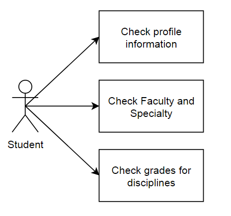 | 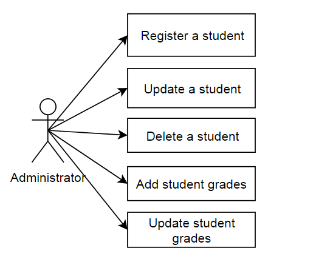 |

| SCREENSHOT | DESCRIPTION |
| --- | --- |
| 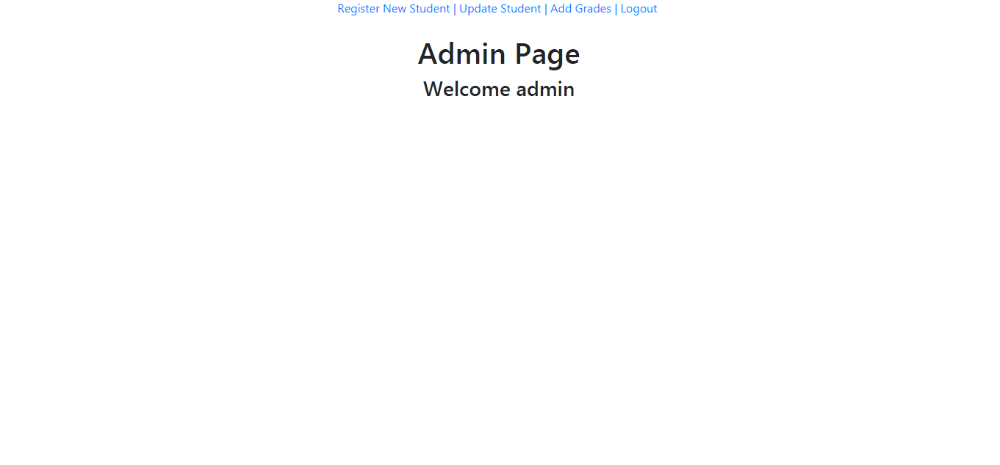 | Admin panel |
| 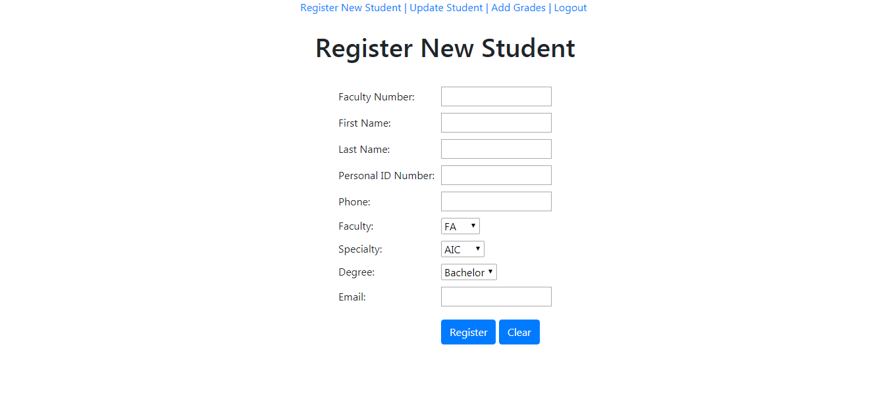 | Register new student form |
| 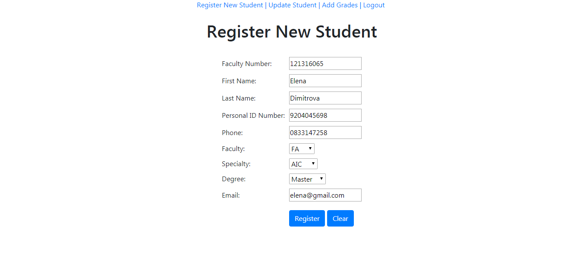 | Register new student form - filled |
| 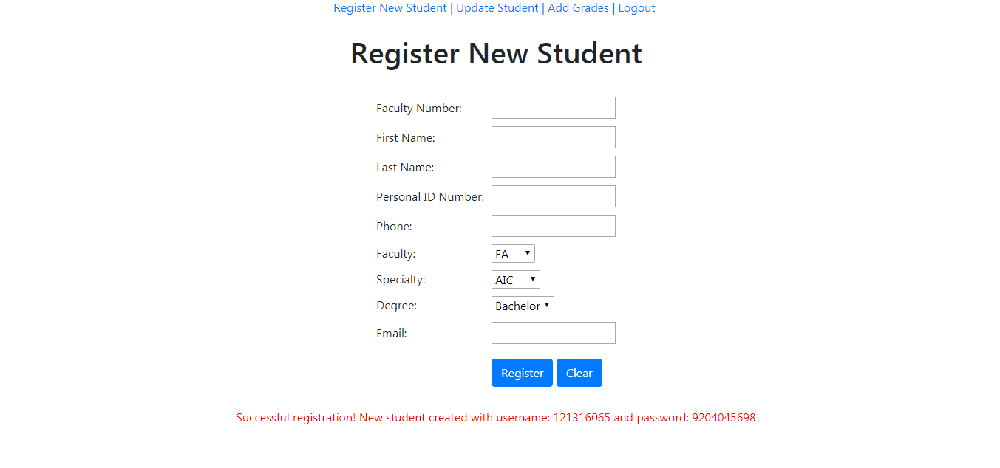 | Success message after registering new student |
| 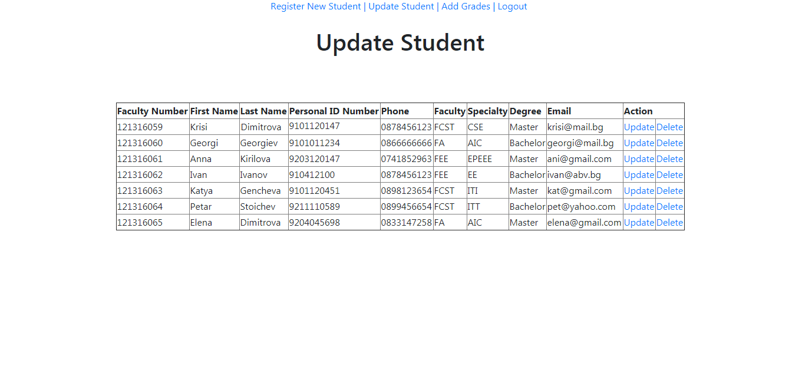 | Update student table - list with all registered students |
| 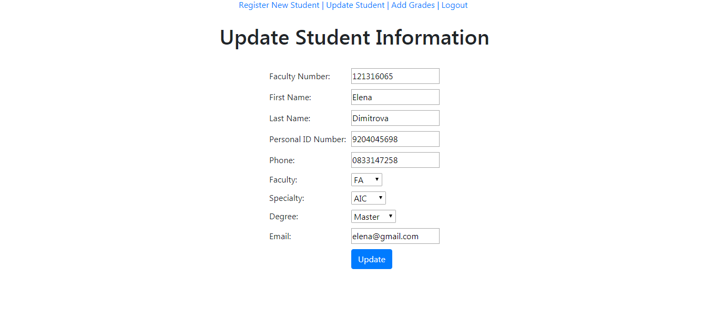 | Update student info - filled form |
| 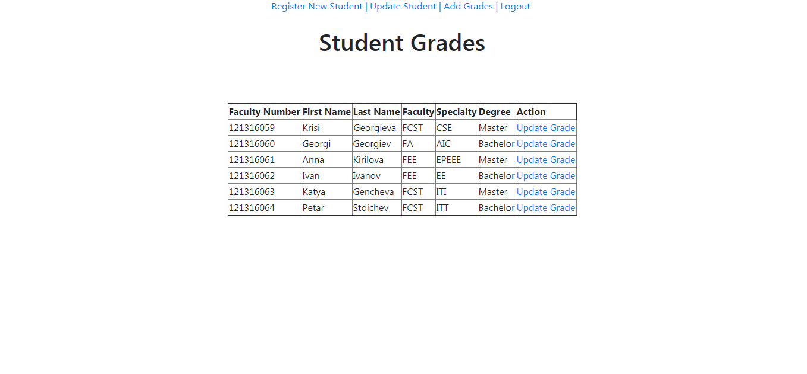 | Student grades |
| 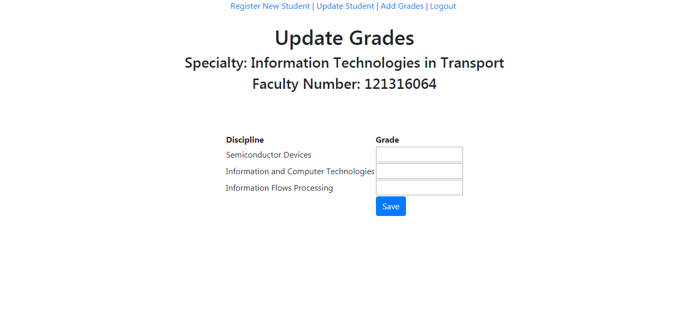 | Student grades - updating specific student grades|
| 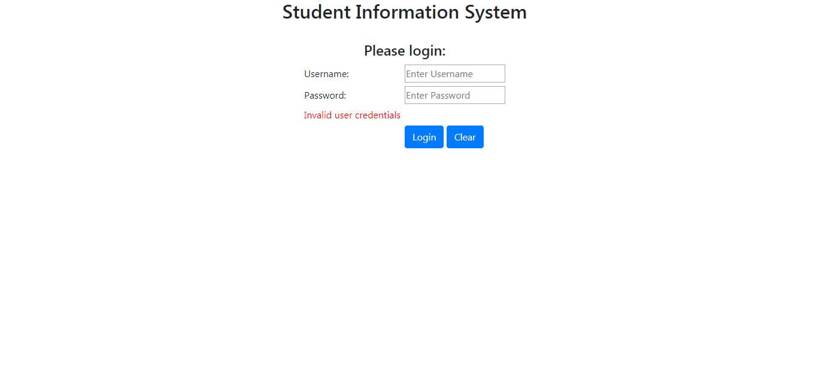 | Login screen - invalid credentials error |
| 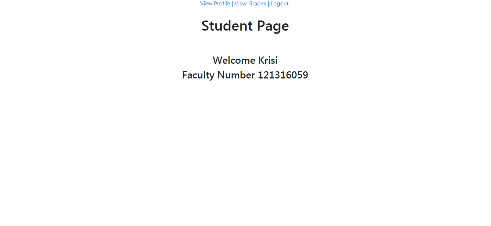 | Welcome page |
| 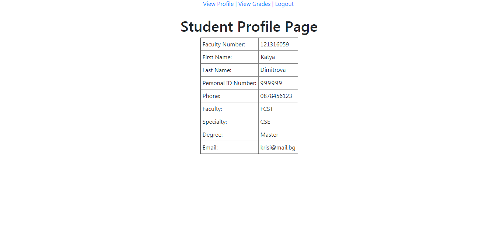 | Student profile page |
| 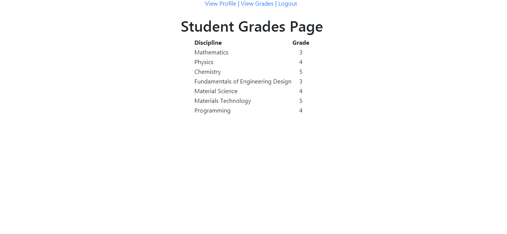 | Student grades page |

